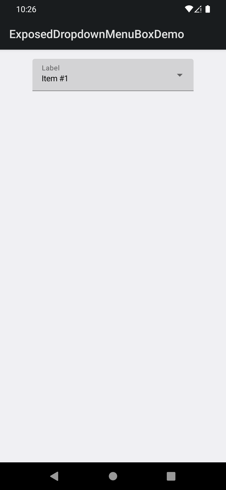
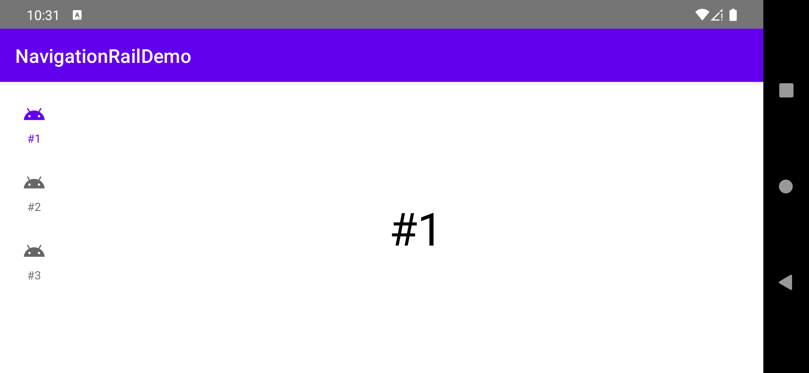
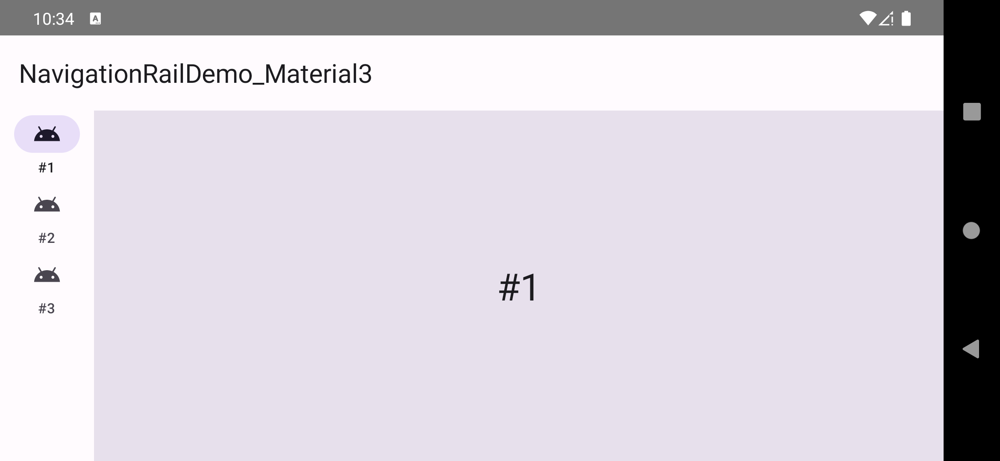
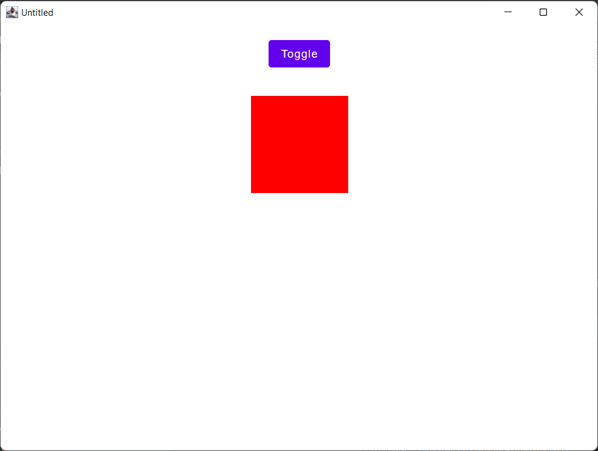
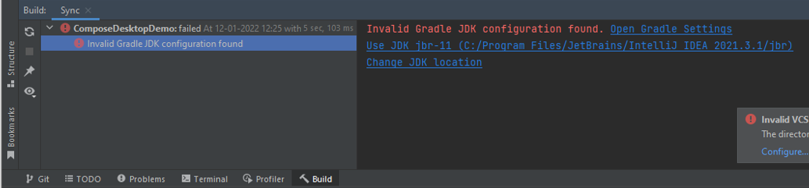

# Chapter 11: Conclusion and Next Steps

### Please note

Depending on your local setup, you might experience an **Invalid Gradle JDK configuration found** error when opening *ComposeDesktopDemo*, which prevents the project from syncing and building. If this is the case, please click on *Change JDK* location and pick a JDK version.

